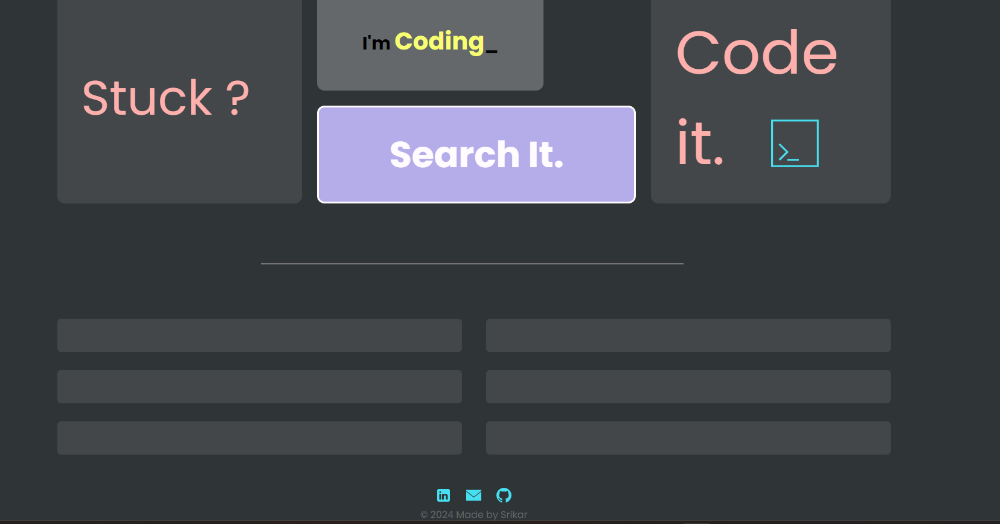
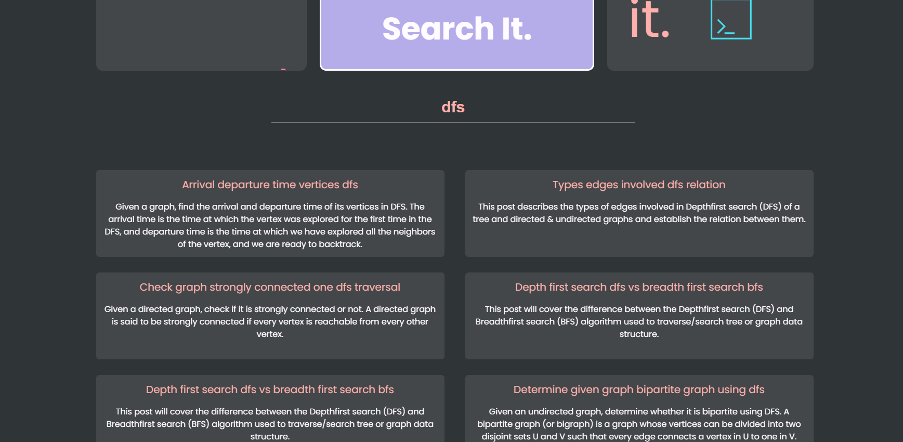
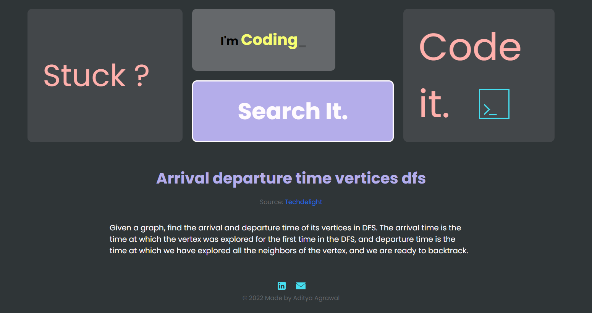

# CodeIt - Search Engine for Coding Problems

CodeIt is a high-performance search engine built using Node.js, Express, and EJS. It is designed to help users find solutions to coding problems from popular platforms such as LeetCode, Codeforces, and InterviewBit. The search engine incorporates advanced natural language processing (NLP) techniques to ensure relevant results and provides a user-friendly interface for query submission.

## Features

- **Search Functionality**: Allows users to search for coding problems based on their query.
- **Stopword Removal**: Removes common stopwords (like "is", "the") from search queries.
- **Punctuation Removal**: Automatically removes punctuation from user input to enhance search accuracy.
- **Spell Correction**: Implements spell-check and correction to handle typographical errors in queries.
- **Lemmatization**: Reduces words to their base form (e.g., "running" becomes "run").
- **Number to Word Conversion**: Converts numeric values in queries to their word equivalents (e.g., "123" becomes "one hundred twenty-three").
- **BM25 Algorithm**: Calculates relevance of documents using the BM25 ranking function.
- **Title Similarity**: Enhances search ranking based on string similarity between the search query and document titles.
- **Document Storage**: Stores coding problems from different platforms for efficient search.

## Technologies Used

- **Node.js**: Backend server environment.
- **Express.js**: Web framework for handling routes and requests.
- **EJS (Embedded JavaScript)**: Template engine for rendering dynamic web pages.
- **Selenium**: Used for web scraping problems from coding platforms.
- **Natural Language Processing (NLP)**: For processing and optimizing search queries.

## Project Structure

```
CODE-IT
│   ├── node_modules/
│   ├── Problems/           # Directory containing scraped coding problems.
│   ├── public/             # Public assets (CSS, JS, images).
│   ├── views/              # EJS view templates.
│   ├── idf.js              # IDF values for BM25.
│   ├── keywords.js         # Keyword processing module.
│   ├── length.js           # Length of documents.
│   ├── magnitude.js        # Magnitude of TF-IDF vectors.
│   ├── tf-gen.js           # Generates term frequency values.
│   ├── index.js            # Main entry point.
│   ├── package.json        # Dependencies and project info.
│   ├── urls.js             # URLs for problems from coding platforms.
│   └── README.md           # Project documentation (this file).
```

## Installation

1. Clone the repository:
   ```bash
   git clone https://github.com/Srikar4510/CodeIt.git
   ```
   
2. Navigate to the project directory:
   ```bash
   cd CodeIt
   ```

3. Install the required dependencies:
   ```bash
   npm install
   ```

4. Ensure you have the problem dataset (scraped coding problems) in the `Problems/` directory.

## Running the Application

1. Start the server:
   ```bash
   npm start
   ```

2. Open your browser and navigate to `http://localhost:3000` to access the search engine.

## How It Works

- **Query Processing**: The search query is split into individual words, and stopwords and punctuation are removed. 
- **Keyword Matching**: The search engine matches the processed keywords against a list of coding problems.
- **BM25 Ranking**: Documents are ranked based on the BM25 algorithm, which uses term frequency (TF) and inverse document frequency (IDF) to calculate relevance.
- **Result Display**: The top 10 results are displayed, sorted by relevance score. Users can click on any result to view the full problem description.

## BM25 Formula

The BM25 algorithm calculates the relevance of a document `D` to a query `Q` using the following formula:

```
BM25(D, Q) = sum_over_terms((TF * (k1 + 1)) / (TF + k1 * (1 - b + b * (doc_len / avg_doc_len))) * IDF)
```

Where:
- `TF` is the term frequency in the document.
- `IDF` is the inverse document frequency.
- `doc_len` is the length of the document.
- `avg_doc_len` is the average document length.
- `k1` and `b` are parameters set to control term frequency saturation and document length normalization.
- 
## Screenshots

### Initial State


### Displaying Search Results


### Question Page 


## Contributing

If you'd like to contribute to this project, feel free to submit a pull request or open an issue on the GitHub repository.

## License

This project is licensed under the MIT License - see the [LICENSE](LICENSE) file for details.

## Contact

If you have any questions, feel free to reach out:

- **Email**: [srikarambula.1924@gmail.com](mailto:srikarambula.1924@gmail.com)
- **LinkedIn**: [Srikar Ambula](https://www.linkedin.com/in/srikar-ambula-66a647277/)
- **GitHub**: [Srikar4510](https://github.com/Srikar4510)
